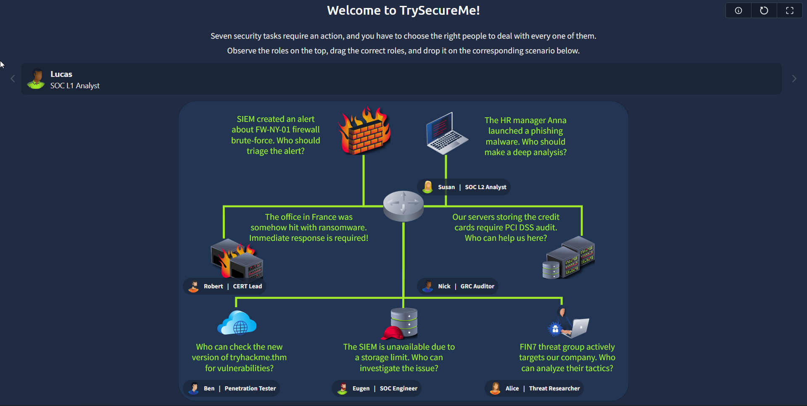

# THM_Blue-Team-Introduction

## Table of Contents
1. [Junior Security Analyst Intro](#junior-security-analyst-intro)
2. [SOC Role in Blue Team](#soc-role-in-blue-team)
3. [Humans as Attack Vectors](#humans-as-attack-vectors)
4. [Systems as Attack Vectors](#systems-as-attack-vectors)

## Junior Security Analyst Intro
### Security Analyst Journey
1. Which team do you work with as a Junior Security Analyst?

    The answer is `SOC`.

### A Day In the Life of a Junior Security Analyst
1. What was the malicious IP address in the alerts?

    The answer is `221.181.185.159`.

2. To whom did you escalate the alert with the malicious IP?

    The answer is `Will Griffin`. We have to report to the senior security analyst, Will Griffin, about the malicious IP address.

3. What message did you get after blocking the IP address on the firewall?

    The answer is `THM{until-we-meet-again}`.

## SOC Role in Blue Team
### Security Hierarchy
1. Which senior role typically makes key cyber security decisions?

    The answer is `CISO`. The Chief Information Security Officer (CISO) is responsible for making key cyber security decisions in an organization.

2. What is the common name for roles like SOC analysts and engineers?

    The answer is `Blue Team`.

### Meet The Blue Team
1. Does Blue Team focus on defensive or offensive security?

    The answer is `defensive`.

2. Which department handles active or urgent cyber incidents?

    The answer is`CIRT`.

### Advancing SOC Career
1. How would you call a cyber security company providing SOC services?

    The answer is `MSSP`. Managed Security Service Providers (MSSPs) offer SOC services to organizations.

2. Which role naturally continues your SOC L1 analyst journey?

    The answer is `SOC L2 analyst`.

### Final Challenge
1. What flag did you claim after completing the final challenge?

    We can answer to get the flag with the picture below:

    

    The flag is `THM{trysecureme_is_secured!}`.
    

## Humans as Attack Vectors
### The Humant Element
1. What or who is the weakest link in cyber security?

    The answer is `Humans`.

2. What do attackers seek when targeting humans in a cyberattack?

    The answer is `access`.

### Attack on Humans
1. What is the name of an attack tactic that manipulates human psychology?

    The answer is `Social engineering`.

2. Which social engineering method is about pretending to be someone else?

    The answer is `Impersonation`.

### Defending Humans
1. Which process is aimed at preventing or reducing the chance of an attack?

   The answer is `Mitigation`.

2. Which mitigation measure is about training employees in cyber security?

    The answer is `Security awareness training`.

### Practice
1. What flag did you receive after completing the "Employees at Risk" challenge?

    The answer is `THM{anyone_else_at_risk?}`.

2. What flag did you receive after completing the "Security Policy" challenge?

    The answer is `THM{human_protection_expert!}`.

## Systems as Attack Vectors
### Definition of System
1. Can cyber attacks happen without victim intervention (Yea/Nay)?

    The answer is `Yea`.

2. Can a breach of just a single system lead to disastrous consequences (Yea/Nay)?

    The answer is `Yea`.

### Attack on Systems
1. What is the term for a security flaw that can be exploited to breach a system?

    The answer is `Vulnerability`.

2. What is the name of the attack when malware comes from a trusted app or library?

    The answer is `Supply Chain`.

### Vulnerabilities
1. What is the CVE for the critical SharePoint vulnerability dubbed "ToolShell"?

    The answer is `CVE-2025-53770`.

2. How would you respond to a detected vulnerability on your system?

    The answer is `patch`.

### Misconfigurations
1. Can a system patch or software update fix the misconfigurations (Yea/Nay)?

    The answer is `Nay`.

2. Which activity involves an authorized cyber attack to detect the misconfigurations?

    The answer is `Penetration testing`.

### Practice
1. What flag did you receive after completing the "Systems at Risk" challenge?

    The answer is `THM{patch_or_reconfigure?}`.

2. What flag did you receive after completing the "Remediation Plan" challenge?

    The answer is `THM{best_systems_defender!}`.
